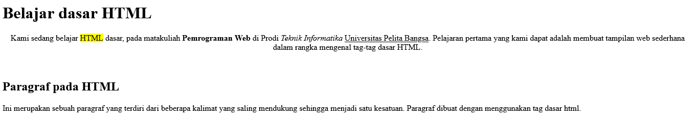

# WEB HTML DASAR

## Membuat Paragraf
`<p>Kami sedang belajar HTML dasar, pada matakuliah Pemrograman Web di Prodi Teknik Informatika Universitas Pelita Bangsa. Pelajaran pertama yang kami dapat adalah membuat tampilan web sederhana dalam rangka mengenal tag-tag dasar HTML.</p>`


## Menambahkan Judul
`<h1>Belajar dasar HTML</h1>`
`<h2>Paragraf pada HTML</h2>`



## Memformat Teks
`<p align="center">Kami sedang belajar <mark>HTML</mark> dasar, pada matakuliah <b>Pemrograman Web</b> di Prodi <i>Teknik Informatika</i> <u>Universitas Pelita Bangsa</u>. Pelajaran pertama yang kami dapat adalah membuat tampilan web sederhana dalam rangka mengenal tag-tag dasar HTML.</p>`


## Menyisipkan Gambar
``


## Menambahkan Hyperlink
`<nav>
    <a href="lab1_tag_dasar.html">Dasar HTML</a>
    <a href="lab1_halaman2.html">Halaman 2</a>
    <a href="http://www.google.com">Halaman Web Eksternal Google</a>
    </nav>
    <hr>`


## Jawab Pertanyaan Berikut:
1. Lakukan perubahan pada kode sesuai dengan keinginan anda, amati perubahannya adakah error ketika terjadi kesalahan penulisan tag?

2. Apa perbedaan dari tag ``<p>`` dengan tag ``<br>``, berikan penjelasannya!

3. Apa perbedaan atribut title dan alt pada tag ````, berikan penjelasannya!

4. Untuk mengatur ukuran gambar, digunakan atribut width dan height. Agar tampilan gambar proporsional sebaiknya kedua atribut tersebut diisi semua atau tidak? Berikan penjelasannya!

5. Pada link tambahkan atribut target dengan nilai atribut bervariasi ( _blank, _self, _top, _parent ), apa yang terjadi pada masing-masing nilai antribut tersebut?

## Jawaban
1. Saya akan melakukan perubahan pada paragraf kedua menjadi bold ``<b>`` dan dibawah ini gambar sebelum saya ubah

a

lalu ini adalah gambar sesudah saya ubah

b

2. tag ``<br>`` berfungsi untuk membuat line break antar kalimat, sedangkan tag ``<p>`` berfungsi untuk membuat paragraf.

3. Atribut title digunakan untuk memberikan informasi tambahan tentang gambar, sedangkan atribut alt digunakan untuk memberikan teks alternatif untuk gambar yang akan ditampilkan.

4. Untuk menjaga tampilan gambar proporsional:
- Lebih baik mengisi kedua atribut `width` dan `height` dengan nilai yang sesuai.
- Jika hanya mengisi salah satu atribut (`width` atau `height`), gambar akan tetap proporsional, tetapi ukurannya bisa terlalu besar atau kecil, tergantung pada atribut yang diisi.

5. Atribut `target` digunakan untuk mengontrol bagaimana tautan tersebut membuka halaman baru:
- `target="_blank"` membuka tautan dalam tab atau jendela baru.
- `target="_self"` membuka tautan dalam tab atau jendela yang sama (nilai default).
- `target="_top"` membuka tautan di tab paling atas dalam hierarki.
- `target="_parent"` membuka tautan di tingkat atas frame jika ada frame dalam halaman web.
